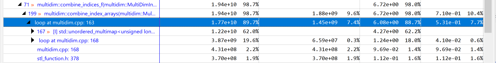

# Multi Dimension Index Folding

**Performance optimization project**

## 1. Description

Consider a structure which defines an array of sparse indices of N-Dimensional space. Sparse becuse we are lacking some
of the dimensions.

E.g. If the indices are known for dimensions 1 and 2 we may them represent as
```javascript
A = [
    indices: [{0, 0}, {0, 1}, {1, 0}],
    dimensions: {0, 1}  // 1 and 2 converted to base 0
]
```

consider now that we want to combine these indices with another set, to obtain an index of higher dimensionality.
```javascript
B = [
    indices: [{0, 2}, {1, 3}],
    dimensions: [1, 2]  // dims 2 and 3
]
```

Given the second set of indices refer to dimensions 1 and 3, one can possibily get a third index set C containing all
three dimensions. Note that nothing prevents the number of dimensions from being different.

The rules to combine the indices are as follows:

 - At least one common dimension
 - Values in common dimensions must be the same.

For example, by applying `C = combine(A, B)` one would get

```javascript
C = [
    indices: [{0, 0, 2}, {0, 1, 2}, {1, 0, 3}],
    dimensions: [0, 1, 2]  // dims 1, 2 and 3
]
```

Notice several combinations were discarded since values in common dimensions were not the same. If they agree the
remaining part of each index (from non-shared dimensions) are appended.

## 2. Compiling the project

Project is CMake based. Typically all you need to do is.

```sh
cmake . -B build
cd build && make
```

It will compile in RelWithDebInfo. However for attempting max performance, please use `cmake .
-DCMAKE_BUILD_TYPE=Release -B build` instead.

For building a very verbose debug version, call cmake with `-DMULTIDIM_DEBUG=1`

### Out binaries

When compiling as above, two main binaries are generated under build:

 - `test_unit` - A set of simple tests to assert basic functionality is correct
 - `benchmark` - A stress program which generates two random datasets of 1M indices each and combines them Due to the
    extreme amount of out data, the binary is compiled with `-DMULTIDIM_BENCHMARKING=1`, a flag that skips the final
    vector append. Some stats are shown.

#### Benchmark program

Under tests, `benchmark.cpp` implements a program which tests the `multidim` library with a relatively large data set.
It generates random index arrays, and possibly random dimensions. The latter were however disabled since different sets
of common dimensions imply very different work loads, which would lead to uneven and incomparable benchmarks.

The default parameters, hardcoded as `constexpr` are:
 - N_DIMENSIONS = 4           // 4-dimensional domain  (M)
 - MAX_INDEX_VALUE = 10000    // Each index for a single dimension in the range [0-10k]
 - MAX_INDICES_LEN = 1 << 22; // Each MultiDimIndexArray contains 4M indices (N)

- The benchmark runs in approximately 6 seconds in an x86_64 Intel CPU (Comet Lake). A typical run looks like
```sh
$ time ./benchmark
Indexing............................................ OK (32001 buckets)
Generating new indices...
[  0%] Generated 5 indices
[  5%] Generated 838560 indices
...
[ 98%] Generated 17163576 indices

real    0m9.735s
```

## 3. Algorithm Optimization

To improve the performance at the algorithm level some assumptions were made:
  1. The input indices arrays can be arbitrarily large (N), but fit in main memory
  2. The highest index value can be in the order of billions
  3. The number of dimensions (M) is much smaller than N, typically up to 10, even though it could be in the order of
     1000s.
  4. The highest dimension will be in the same order of magnitude as M, although it could  be in the order of millions.

To combine two arrays (size N) in a resource effective manner one must, in the first place, avoid comparing all-to-all
which would incur complexity O(N * N). Second, since we can't avoid considering an index, e.g. from A set, against a
number of elements from set B, we can also leverage from doing some preprocessing and do operations once, avoiding an
additional complexity factor O(N * M).

### 3.1 Mapping elements

To address the first concern one grouped all indices from one of the arrays (e.g. A) and indexed them by their values on
the common dimensions. This is possible given the common set of dimensions is static and can be computed ahead of time.
The mapping is an O(N*M) operation; however by considering M small, it can be accounted for a constant factor.

If A indices are mapped, one can go along indices from B and get all matching indices from A in a single O(1) map.get().
At this point it matters that the "merging" of two indices is fast as well. That's explained in the next point.

### 3.2 Preprocess for O(N) index merging

Right, we are in an arbitrary index from B, we got the bucket of A indices whose common dimensions's match. The bucket
can still hold many values, in particular if the domain of the keys is small (e.g. a single common dimension, or the
indices domain is small - say indices from 1-10 only could ony partition all data in 10 buckets).

For maximum speed it would be great to "sum" the two indices, without much processing, especially no indirections ot
conditionals. However that can't be done in their original format. The "dimensions" array imposes an indirection which
we have to address. Nevertheless we can exploit pre-processing.

Besides the common dimensions, also the final "combined" dimensions can be precomputed. Therefore, at the time we
map/bucket one of the arrays, instead of storing the original index, we can store a version which only contains the
required output dimensions. As for the output dimensions which don't figure in the current index, we can only choose a
neutral 0.

E.g. in the original example, if we were to index B indices, we would

 - take Index `{0, 2}` - transform to `{0, (0), 2}`  (expand dimensions from {1,2} to {0,1,2})
    - Assign it to bucket with key 0 (given the common dimension (1) has value 0)
 - take Index `{1, 3}` - transform to `{0, (1), 3}`
    - Assign to bucket with key 1

With the indices in this format one doesn't need indirections to combine them. Unfortunately we cannot simply sum them
due to the common dimensions - we don't want them to double. However a bitwise-OR will do just what we want, since we
are either OR-ing the same number (from common dimensions), or a number with the neutral zero mentioned before.

### 3.3 Computing the merged dimensions

 ... Linear as well

## 4. Low-Level Optimization

To take the advantage of modern CPUs, in particular those based on recent x86_64 with vectorized instructions and large
cache sizes, attention was made to the implementation. Generally, it was attempted to have inner loops without
branching, over contiguous arrays. With that we have the highest cache locality, and a chance for the compiler to use
SIMD instructions.

To enable GCC and Clang compilers auto-vectorization, `-march=native` and `-O3` flag were enabled (with
`-DCMAKE_BUILD_TYPE=Release`). We can notice vectorization does happen as the compiler outputs messages like
`small_vector.hpp:2267:86: optimized: basic block part vectorized using 32 byte vectors`

### 4.1 Improving Memory locality

One of the performance decisions was to use a library which would attempt to reduce memory indirections. Typically,
without a-priory knowledge of the arrays length, space is allocated from the heap (std::vector behavior). However, as
per assumption 3, we may want to optimize for a common case, meaning, we could use a structure that uses stack space
first until a certain number of elements, after which it would claim heap space. The concept is known as small_vector
and implementations from Boost, LLVM and others exist. For simplicity purposes we used a header only implementation from
Gene Harvey (gch/small_vector.hpp). By default it can hold 64 bytes within which translates to 8 * uint64_t (our
IndexElemT) or 16 * uint32_t (our DimensionT). We kept both counts consistent at 8.

When reading along vectors of these structures elements are guaranteed to be inlined and 100% contiguous, making
effective use of cache. The effects are expressive. For testing, a version compiled using purely `std::vector` shows the
following times
```
real    1m2.193s
user    1m1.035s
sys     0m0.361s
```

Comparing the results with those from section [2] (9.7s) empress an improvement of over 6x.

For that result contributed the sequential processing of `combine_index_arrays`, in particular the inner-most loop (joining two indices with OR), operating on the contiguous elements.

### 4.2 Manual vectorization & loop unrolling

Compiler Automatic vectorization might not be up to the expectations. Therefore, in the separate `smalldim_opt.hpp`
source, some exploratory work was done to implement core routines in an optimized way.

Inside, the function `expand_index()` gets a specialization for the type `CompactIndexT` (aka an array of static size
4), and attempts to aggressively optimize the most common case: up to 4 dimensions. Given a 4D index is composed of
64bit unsigned values, we could in principle operate on the whole array with a single AVX2 instruction. Specifically
`_mm256_i32gather_epi64` could potentially be useful to filter the index dimensions. However, due to limited
applicability and  and the corner cases that path was not pursued.

An alternative was therefore explored, by manually unrolling compile-time known loop to take advantage of the CPU
multiple ALU ports.

## 5 Benchmarking Insights

Where is time being spent? Is it worth more vectorization?

We collected some profiling data using HPCtoolkit.
```sh
hpcrun -c f1000000 -e PERF_COUNT_HW_CPU_CYCLES -e REALTIME ./benchmark
hpcstruct hpctoolkit-benchmark-measurements/
hpcprof -S benchmark.hpcstruct hpctoolkit-benchmark-measurements/
```


It is noticeable that the largest amount of time is spent in the main loop of `combine_index_arrays`. However, one fact
stand out: it is NOT directly code inside loop that take the most time (7.4%). Instead it is its children, in particular
line 167 for the retrieval of the range from the map (see [full_profile_image](docs/profile-1.png)), accounting for 62%
of the time.

With larger volumes of data is expected that retrieving data gets slower, as data does not fit in cache, and given the
access pattern is basically random we might be facing cache misses. To be sure about that, some perf analysis was
performed.

```
sudo perf stat -M TopdownL1 ./benchmark
(...)
       11136097315      INST_RETIRED.ANY                 #     16.8 %  tma_retiring
         131446757      CPU_CLK_UNHALTED.REF_XCLK        #      1.5 %  tma_frontend_bound
                                                         #     81.3 %  tma_backend_bound
                                                         #      0.4 %  tma_bad_speculation

sudo perf stat -M TopdownL2 ./benchmark
(...)
 Performance counter stats for './benchmark':

       10679178608      INST_RETIRED.ANY                 #      0.6 %  tma_fetch_bandwidth
                                                         #      3.6 %  tma_heavy_operations
                                                         #     14.2 %  tma_light_operations
         133689641      CPU_CLK_UNHALTED.REF_XCLK        #      0.9 %  tma_fetch_latency
                                                         #     -0.7 %  tma_branch_mispredicts
                                                         #     -0.1 %  tma_machine_clears
                                                         #      8.1 %  tma_core_bound
                                                         #     73.4 %  tma_memory_bound

# At the third level one can understand the memory bounds
sudo perf stat -M TopdownL3 ./benchmark

Performance counter stats for './benchmark':

       10295560298      INST_RETIRED.ANY                 #      0.0 %  tma_fp_arith
         130291771      CPU_CLK_UNHALTED.REF_XCLK        #      1.4 %  tma_l2_bound
                                                         #     47.0 %  tma_dram_bound
       12909163933      UOPS_EXECUTED.THREAD
        9011882614      CYCLE_ACTIVITY.STALLS_L2_MISS
        9411022989      CYCLE_ACTIVITY.STALLS_L1D_MISS
          10840254      MEM_LOAD_RETIRED.L2_HIT
       10742648347      UOPS_ISSUED.ANY
         134906937      CPU_CLK_UNHALTED.REF_XCLK        #      0.3 %  tma_store_bound
                                                         #      6.2 %  tma_ports_utilization
(...)
       11951297032      UOPS_ISSUED.ANY
          27567653      ARITH.DIVIDER_ACTIVE
         134065231      CPU_CLK_UNHALTED.REF_XCLK        #     10.1 %  tma_l3_bound
                                                         #      5.6 %  tma_memory_operations
                                                         #      4.9 %  tma_other_light_ops
```

Directly from TopdownL2 Metrics one can directly observe we are memory bandwidth bound, as accessing memory amounts to
73% of the time, whereas "core-bound" operations only amount to 8%. From the L3 metrics one can observe memory
performance is bound mostly from DRAM (47%).
